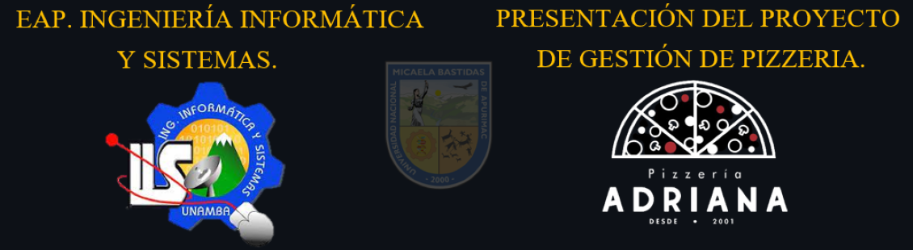
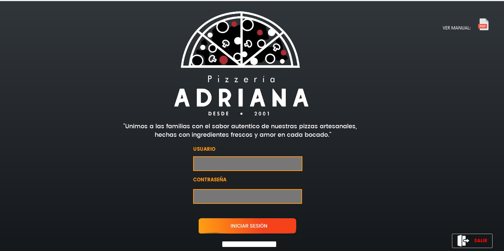
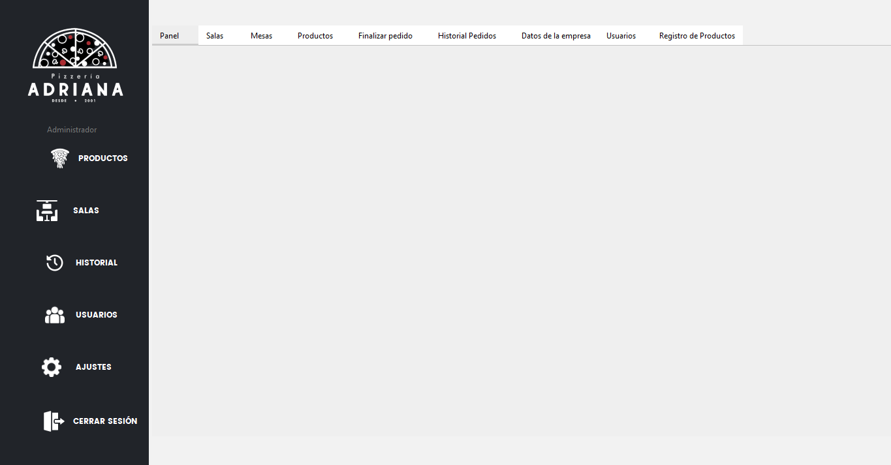
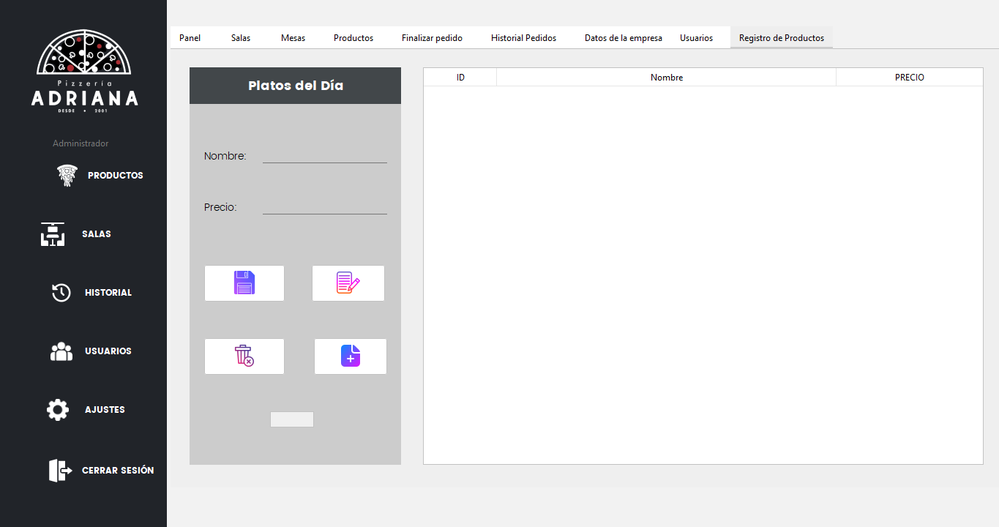
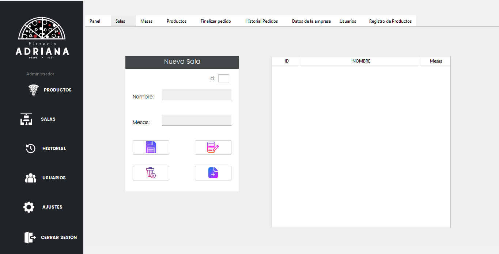
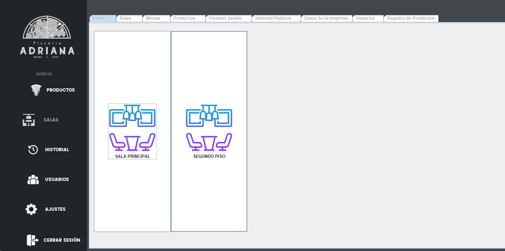
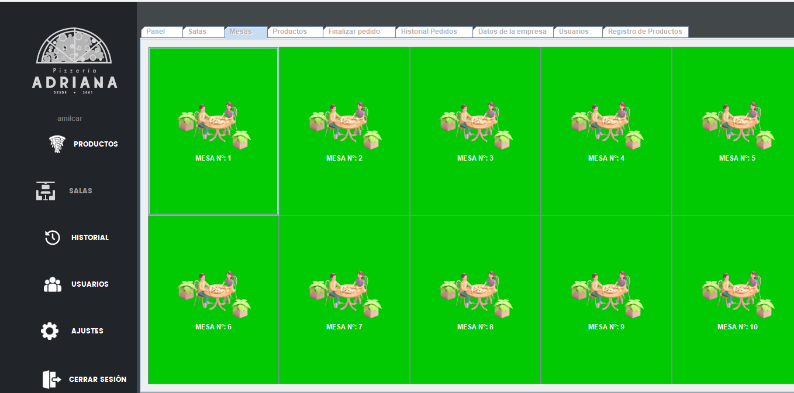
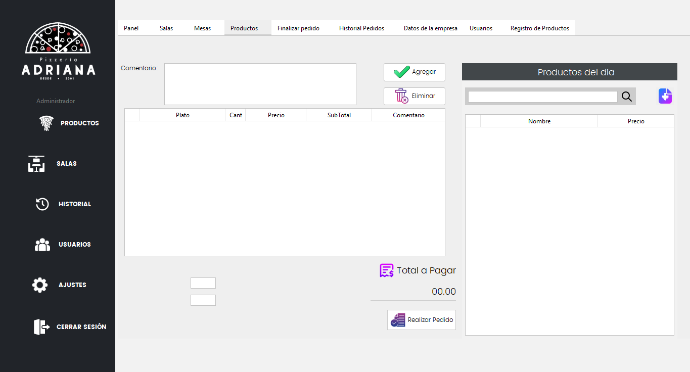
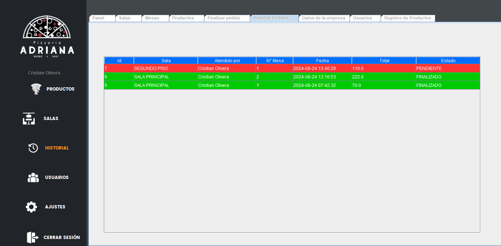
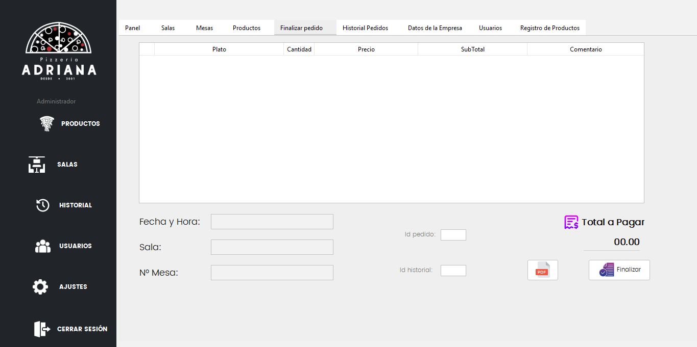

# 🍕 Sistema de Gestión y Control de Pizzería


## 📝 Descripción

Este proyecto es un **software de escritorio** diseñado para optimizar la **gestión de pedidos y cobros** en una pizzería. Automatiza procesos clave como la toma de pedidos, procesamiento de pagos y seguimiento de operaciones, mejorando la **eficiencia operativa** y la **experiencia del cliente**.

## 📑 Tabla de Contenidos

- [🔧 Instalación](#-instalación)
- [✨ Características](#-características)
- [🖼️ Interfaces](#-interfaces)
  - [🔐 Login](#-login)
  - [🏠 Menú Principal](#-menú-principal)
  - [📦 Registro de Productos](#-registro-de-productos)
  - [🏠 Registro de Salas](#-registro-de-salas)
  - [🎟️ Elegir Sala](#-elegir-sala)
  - [🪑 Elegir Mesa](#-elegir-mesa)
  - [🍽️ Elegir Platos para Mesa](#-elegir-platos-para-mesa)
  - [📜 Historial de Pedidos](#-historial-de-pedidos)
  - [💵 Finalizar Pedido](#-finalizar-pedido)
- [🛠️ Tecnologías Utilizadas](#-tecnologías-utilizadas)
- [👥 Colaboradores](#-colaboradores)
- [💡 Agradecimientos](#-agradecimientos)


## 🔧 Instalación
  Instrucciones sobre cómo instalar y configurar el proyecto en un entorno local.  
  1. Clonar o descargar el Repositorio   
  ```bash
# Clonar el repositorio
git clone https://github.com/CristianOlivera1/Proyecto_Pizzeria_Java.git
  ```
  3. Descargar la Base de datos  
    Descarque el Script (.sql) del main del proyecto y ejecutelo
  4. Para crear tu usuario y ingresar al sistema comunicarse con el creador del Proyecto.
    
## ✨ Características
- **📝 Módulo para Mozos**: Digitaliza y gestiona pedidos de manera eficiente, incluyendo la opción de cerrar mesa. Este módulo ayuda a reducir errores en la toma de pedidos y mejora la satisfacción del cliente al garantizar una gestión precisa y fluida.

- **📊 Sistema de Seguimiento en Tiempo Real**: Proporciona herramientas para supervisar y controlar pedidos y cobros en tiempo real. Optimiza la operación de la pizzería al ofrecer una visión clara del estado de cada pedido y pago, facilitando una gestión efectiva.

- **📈 Análisis de Tiempos y Tareas**: Permite identificar ineficiencias operativas y mejorar la productividad del personal mediante el análisis de tiempos y tareas. Ayuda a destacar áreas que pueden ser optimizadas para una operación más eficiente.

## 🖼️ Interfaces

### 🔐 Login
Pantalla de autenticación donde los usuarios ingresan sus credenciales para acceder al sistema.


### 🏠 Menú Principal
Vista inicial del sistema después de iniciar sesión, que proporciona acceso a todas las funciones principales del software.


### 📦 Registro de Productos
Formulario para añadir nuevos productos al inventario, incluyendo campos para nombre, descripción, precio y categoría.


### 🏠 Registro de Salas
Interfaz para gestionar las salas dentro de la pizzería, permitiendo la creación, modificación y eliminación de salas.


### 🎟️ Elegir Sala
Pantalla para seleccionar una sala específica para un nuevo pedido, mostrando una lista de salas disponibles.


### 🪑 Elegir Mesa
Interfaz para seleccionar una mesa dentro de la sala elegida, mostrando la disposición y disponibilidad de las mesas.


### 🍽️ Elegir Platos para Mesa
Pantalla para añadir platos al pedido según la mesa seleccionada, mostrando el menú disponible para la selección de platos.


### 📜 Historial de Pedidos
Registro de todos los pedidos realizados, mostrando detalles como fecha, hora, mesa y estado del pedido.

### 💵 Finalizar Pedido
Interfaz para procesar el pago y cerrar el pedido, incluyendo la revisión del pedido, aplicación de descuentos y finalización de la transacción.


## 🛠️ Tecnologías Utilizadas

- **Lenguaje de Programación**: Java.
- **Base de Datos**: MySQL.
- **Frameworks**: Swing.
- **Entorno de Desarrollo**: Apache NetBeans IDE 18​.

## 👥 Colaboradores

- **Cristian Olivera Chávez** - Desarrolador Principal
- **Giovanni TTito Ccaccasto** - Desarrollador
- **Yhury Cristiam Anampa Quispe** - Tester
- **Amílcar Virto Loayza** - Documentación
- **Luis Fernando Juarez Peña** - Desarrollador (UI/UX)

## 💡 Agradecimientos

Agradecemos al profesor **Julio Cesar Lloclli Champi** por su valiosa orientación y apoyo durante el desarrollo de este proyecto.


